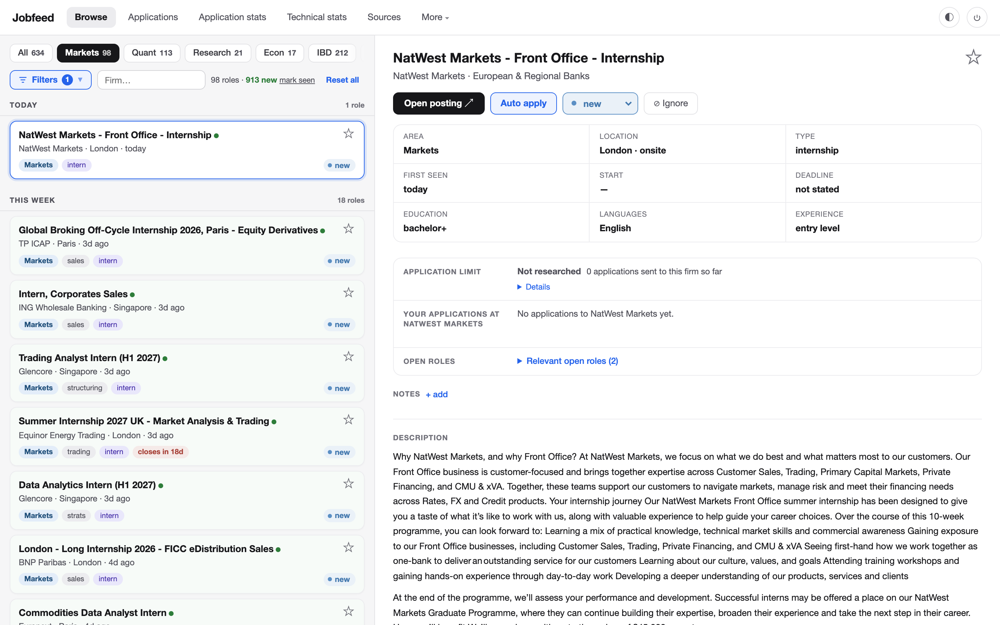
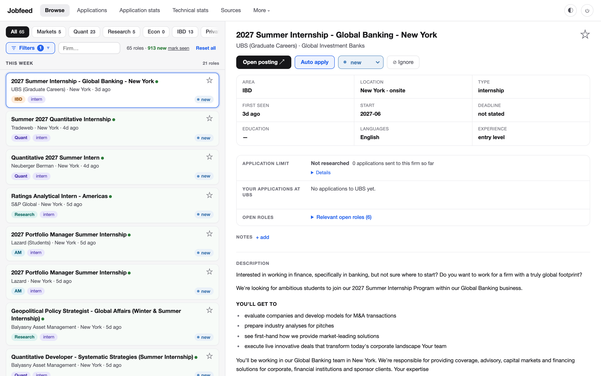
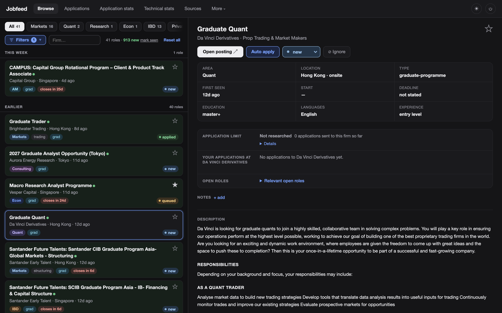
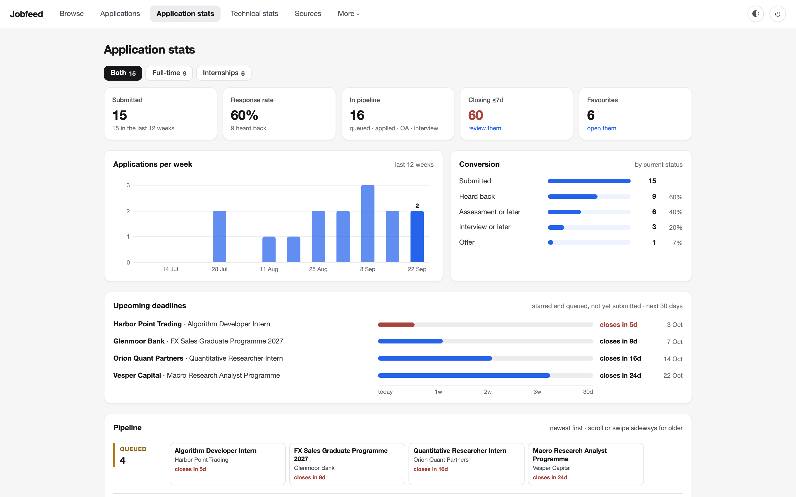
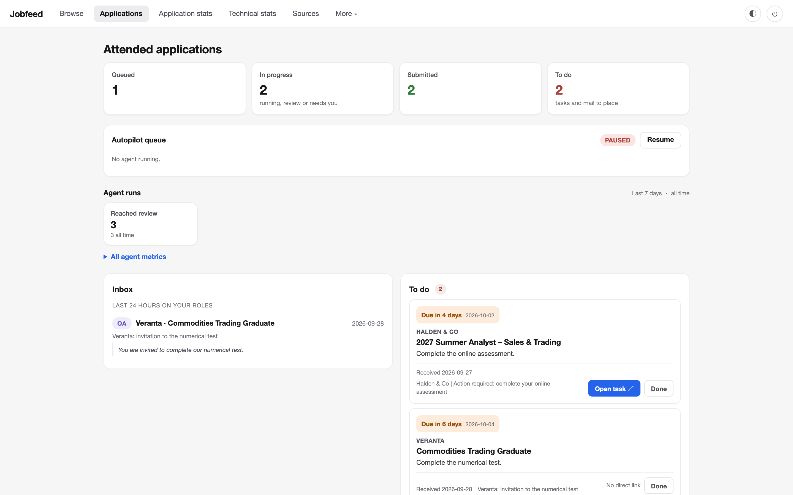
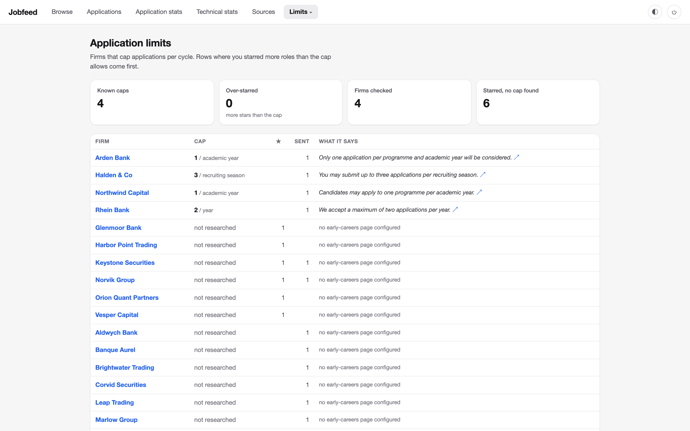
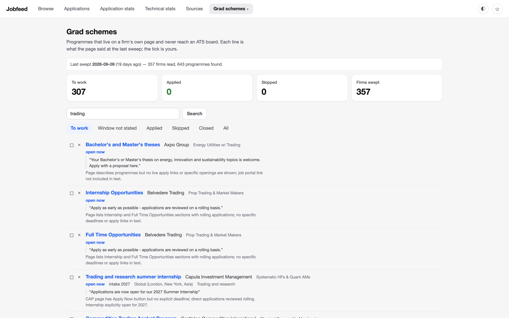
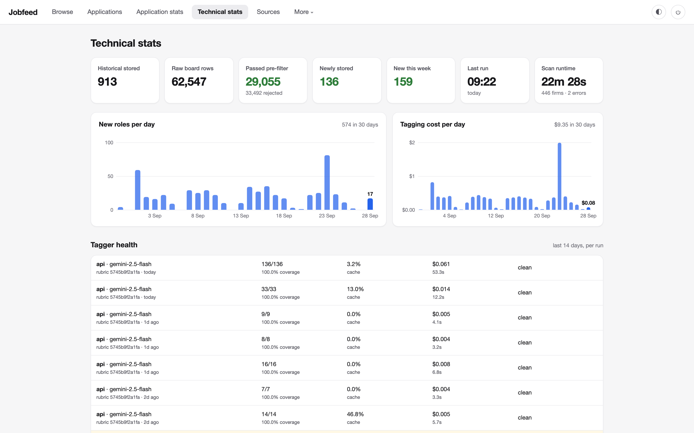

# Jobfeed

A self-hosted job-market scanner for finance. It reads about 450 company career
boards directly at the ATS level (Workday, Greenhouse, Oracle HCM,
SuccessFactors, Avature, SmartRecruiters and more), stores every role in SQLite,
tags each one with structured facets through an LLM, and serves a filterable web
app with application tracking.

Why read the ATS directly instead of an aggregator? Postings show up the day
they go live, where aggregators lag by days or miss boards entirely. Coverage is
exactly the firms you choose, and nothing is ranked or hidden by someone else's
algorithm.

I built this to run my own graduate job search in European finance. It is
general enough to point at any set of firms: the per-ATS handlers don't care
which industry a board belongs to.



<sub>All screenshots come from a demo database: real public postings, plus an
invented application history at fictional firms.</sub>

## What it does

### Browse every role in one place

Every stored role is tagged by area (markets, quant, research, IBD, private
markets and more), desk, seniority, programme type, city and region, working
mode, language requirements, education and minimum experience. Filters combine
freely, closing dates are read from the posting itself, and each role opens with
its full description.

| New York internships | APAC graduate programmes, dark theme |
| --- | --- |
|  |  |

### Track applications

Statuses move from queued through applied, assessment and interview to offer or
rejection. The inbox updates them from confirmation and rejection mail, quoting
the sentence behind every change, and the stats page turns them into a funnel,
a weekly cadence and upcoming deadlines.

| Application stats | Applications, inbox and tasks |
| --- | --- |
|  |  |

Some firms cap applications per cycle ("one programme per academic year"). The
Limits page records each cap with the sentence it came from, before the first
form goes out, because the choice of where to spend a capped application cannot
be undone.



### Find programmes that never reach an ATS

Many graduate schemes live only on a firm's own careers page. A sweep
reads those pages and lists each programme with its application window, quoting
the page so every line can be checked.



### Watch the pipeline itself

Technical stats reports each scan's funnel from raw board rows to stored roles,
new roles per day, tagging cost and the tagger's coverage, cache use and
latency per run.



## How it works

One scan (`python -m jobfeed`) runs four stages in order:

1. **Scrape.** 95 per-ATS handlers in `scrapers/` pull each board configured in
   `targets.json`. Heavy boards run as killable subprocesses
   (`jobfeed/heavy_scrape.py`).
2. **Filter.** `jobfeed/filter.py` only removes unambiguous noise (back-office
   locations, senior rungs, years-of-experience walls, pre-degree programmes)
   and keeps everything else. The principle is **store broad, filter in the
   UI**: preferences are reversible toggles on the site rather than destructive
   drops at scrape time, so widening the net never silently loses a role.
3. **Enrich.** Many ATSes leave the description out of the listing, so a
   per-ATS enricher in `scrapers/enrich/` fetches the real body. Without it the
   tagger would see only title, company and location.
4. **Tag.** `jobfeed/tag.py` runs a structured model pass that writes the facets
   the web app filters on, plus description-derived ones (language
   requirements, education floor, minimum experience, start date). The model
   gets a targeted excerpt, the posting's opening plus its requirements section,
   rather than a blind first-N-characters window.

`web/app.py` (FastAPI, Jinja2 and HTMX) reads the same `jobs.db` and serves the
browse, filter and tracking screens, plus a `/api/jobs` JSON endpoint. Review
turns human confirmations and corrections into a frozen evaluation set keyed by
provider, model and prompt hash, with dedicated metrics for the two mistakes
that hide relevant jobs: false `manager` labels and finance roles tagged
`other`.

Everything is designed to **fail loud**. A scraper that hits an anomaly raises
instead of returning an empty list, because downstream logic reads "empty" as
"the board has no openings". A weekly `jobfeed/selfcheck.py` catches the quiet
failures (silent collapses, dead apply links, stub descriptions, tagging
regressions), and the Sources tab shows broken boards the same day. The
scheduled run emails on every hard failure, such as a scan abort, git
divergence or an expired tagger login (`jobfeed/notify.py`), and the web app
shows a banner if no scan has touched the database for two days.

## Attended applications

An optional layer helps fill applications, built around one boundary:
**software prepares, a person submits.** Nothing in this repository presses a
final submit button, and only the owner can mark an application as submitted.

- **Attended filling** (`applications/autopilot.py`, `applications/launcher.py`,
  `ops/macos/`) hands one posting at a time to a browser agent that fills the
  form up to its review page and stops there for a person to check and submit.
  A serial queue allows exactly one live agent and moves on only when the
  previous one has provably stopped.
- **Status from the inbox** (`applications/mail.py`) matches mail only against
  roles already acted on, records nothing unless exactly one candidate
  survives, and keeps the quoted sentence behind each change.
- **Run telemetry** (`applications/runs.py`, `scripts/agaudit.py`) reads the
  agent's own records to report steps, model calls, permission prompts and rule
  breaks per run, so every filled form can be audited.

The scanner, tagger and Browse work without any of this. The layer needs a
local applicant profile (`secrets/applicant_profile.example.json` shows the
schema) and is macOS-specific.

## Repository layout

| Path | What it holds |
| --- | --- |
| `jobfeed/` | the scan: entry point (`python -m jobfeed`), SQLite layer, filter, tagger, health monitors |
| `scrapers/` | one handler per ATS; `scrapers/enrich/` fetches full descriptions |
| `web/` | FastAPI and HTMX app: Browse, applications, stats, sources |
| `applications/` | optional application tracking and attended filling |
| `bin/` | stable command-line entry points for the application layer |
| `ops/` | scheduled-run script, launchd setup, macOS helper source |
| `scripts/` | maintenance and evaluation tools (tagger gold set, cost, audits) |
| `tests/`, `evals/`, `docs/` | test suite, tagger evaluation set, operational notes |
| `targets.json` | the configured firms and their ATS boards |

## Quickstart

Requires Python 3.10 or later (developed on 3.12) and
[uv](https://docs.astral.sh/uv/). Tagging uses any OpenAI-compatible
`/v1/chat/completions` API, or the authenticated Claude CLI. The production
setup is API-first: set `TAG_PROVIDER=api` with `TAG_API_BASE_URL`,
`TAG_API_MODEL` and `TAG_API_KEY` in `.env`. The CLI is used only if that API
fails, and an Anthropic Messages API key can stay as a final fallback. Skip
tagging entirely with `--no-tag`.

```bash
git clone https://github.com/mcs0002/jobfeed.git
cd jobfeed
uv venv --python 3.12
uv pip sync requirements.lock
cp .env.example .env

.venv/bin/python -m jobfeed --verify --company "Qube Research & Technologies"  # fast smoke test
.venv/bin/python -m jobfeed --verify    # optional full sweep of every source; long-running
.venv/bin/python -m jobfeed --no-tag    # first scan without an API key: scrape, enrich, store
# After configuring the TAG_* settings in .env:
.venv/bin/python -m jobfeed             # scrape, enrich, tag, store
```

Useful flags: `--all` reports every live match, not just unseen ones;
`--dry-run` writes nothing to the database; `--no-tag` skips tagging;
`--workers N` sets concurrent company scrapes (default 6); `--company "Exact
Name"` restricts a scan or verification and can be repeated. A full
verification runs the heavy sources one at a time alongside the light pool, so
it can take many minutes and may print nothing between its first line and the
final per-source report.

The repository ships no `jobs.db`: a new installation starts empty and builds
its own dataset. Most boards need no credentials. Koch Supply & Trading is the
exception, because its AWS WAF requires a short-lived browser cookie: follow
[`docs/KOCH_CAPTURE.md`](docs/KOCH_CAPTURE.md), or accept one explicit Koch
error while the rest of the scan continues.

Playwright's Python package comes from the lock file. Its Chromium binary is
needed only if a Workday board returns HTTP 422 and triggers the browser
fallback. Install it once with:

```bash
.venv/bin/playwright install chromium
```

Then start the web app and open http://localhost:8000:

```bash
.venv/bin/uvicorn web.app:app
```

Set `WEB_PASSWORD` in `.env`, or `WEB_ALLOW_NO_AUTH=1` for localhost-only use.
`WEB_GUEST_PASSWORD` adds a second, read-only login limited to Browse,
Technical stats and Sources. Every other route is denied by a server-side
allowlist, so a new page stays owner-only until it is explicitly admitted, and
guests never see status, favourites or read state. For an always-on setup, run
`python -m jobfeed` from cron or launchd on any schedule and put the web app
behind a tunnel; `ops/setup_web.sh` is a complete launchd example.

## Configuring firms

`targets.json` is a list of boards. The shipped file is a curated set of
finance employers (banks, asset managers, hedge funds, trading firms,
consultancies, insurers) and works out of the box. One entry:

```json
{
  "name": "J.P. Morgan",
  "category": "Global Investment Banks",
  "ats": "oracle_hcm",
  "oracle_hcm": { "base_url": "https://jpmc.fa.oraclecloud.com", "site": "CX_1001" },
  "verified": true
}
```

To add a firm, find which ATS its careers page runs on (the URL usually gives it
away: `myworkdayjobs.com`, `boards.greenhouse.io`, `*.fa.oraclecloud.com`), add
an entry with that handler's config block, and run `python -m jobfeed --verify`
to confirm it resolves. Every ATS must also declare how its descriptions are
fetched in `scrapers/enrich/coverage.py`; a new source without one fails the
test suite, which keeps the tagger from silently working on stubs.

The tagging taxonomy (what counts as markets, asset management, risk and so on)
lives as a prompt in `jobfeed/tag.py` and is finance-specific. Pointing the
project at another industry means rewriting that prompt, and nothing else.

## Scope and conduct

The scrapers read the same public, unauthenticated endpoints that the firms' own
career pages call: no logins, no paywalls, and far less traffic than one person
clicking through the site (most boards take one JSON request per scan). Postings
are facts published to be read. If you fork this, keep it that way: personal
use, polite volumes, public data. `docs/SCRAPER_RESILIENCE.md` discusses the
legal and durability picture in more depth.

## Testing

```bash
.venv/bin/python -m pytest
```

## Docs

- `docs/SCRAPER_RESILIENCE.md`: what breaks, why and how often, with a
  12-month durability analysis.
- `docs/SOURCE_HEALTH.md`: how source health is monitored, and the repair
  history with its lessons.
- `docs/BLOCKED.md`: the checklist to run before marking a source manual.
- `docs/GRAD_SCHEMES.md`: where graduate programmes are found.
- `jobfeed/manual_check.py` prints every source the scan skips, with its
  reason; the same list is on the Sources page.

## License

MIT, see `LICENSE`.
